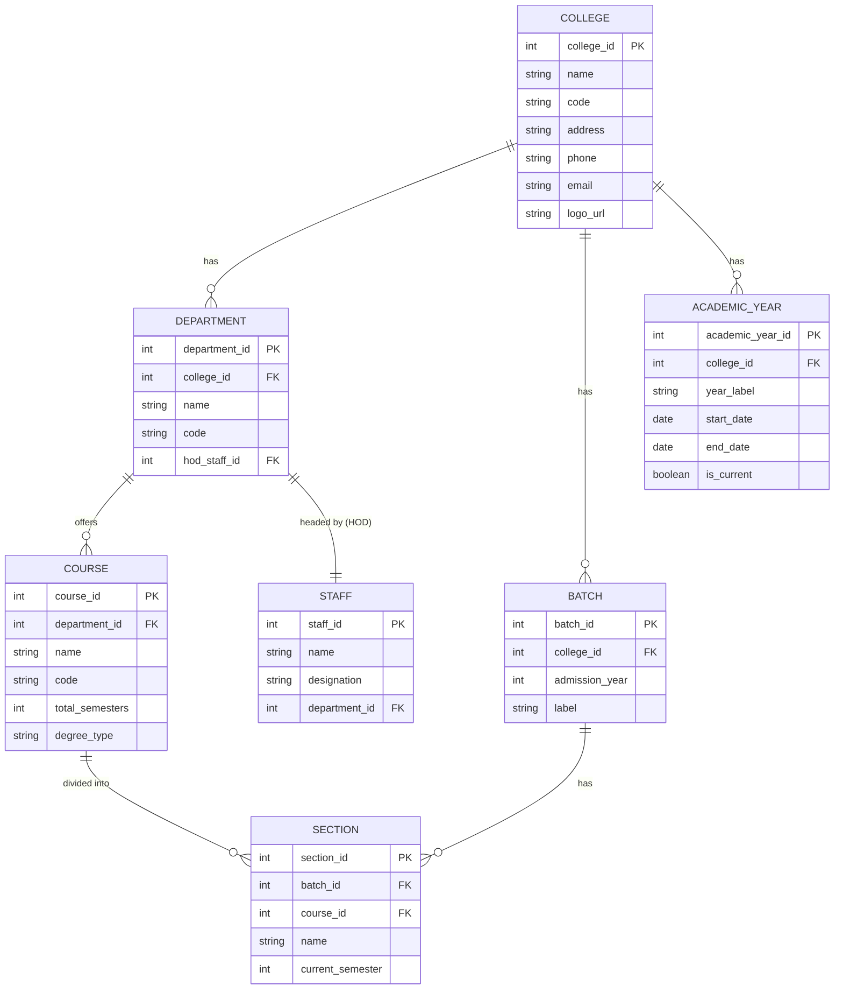
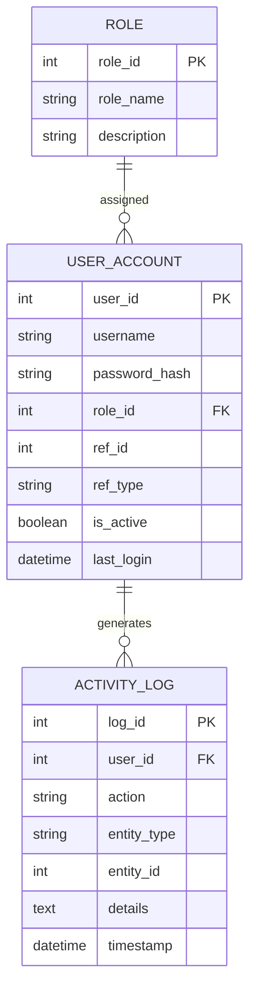
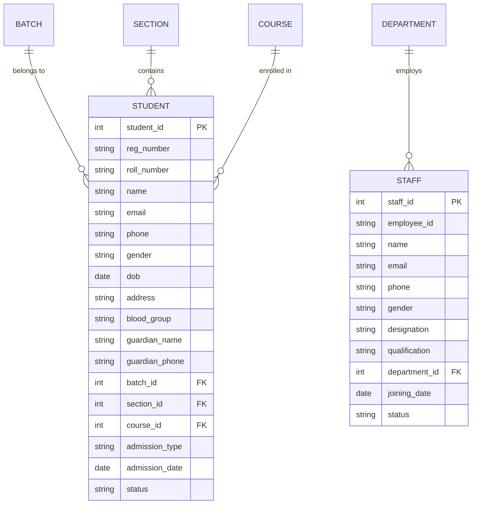
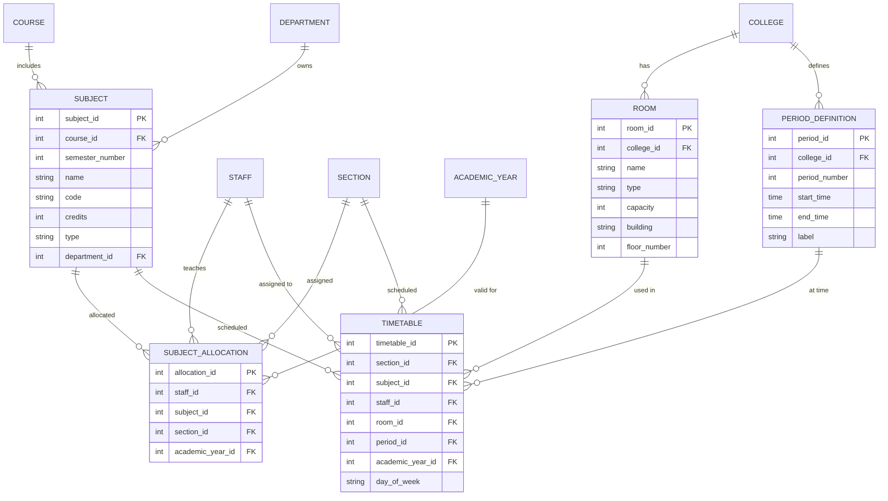
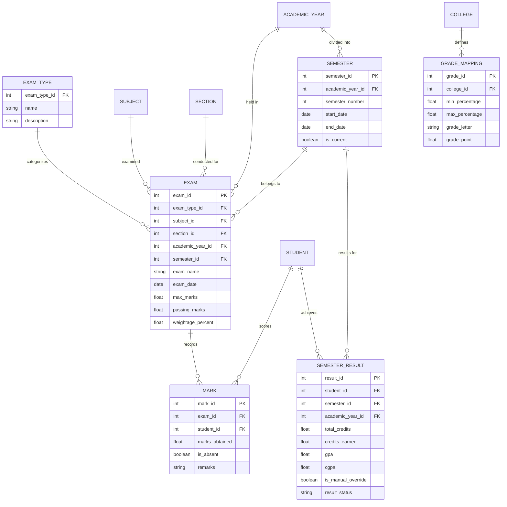
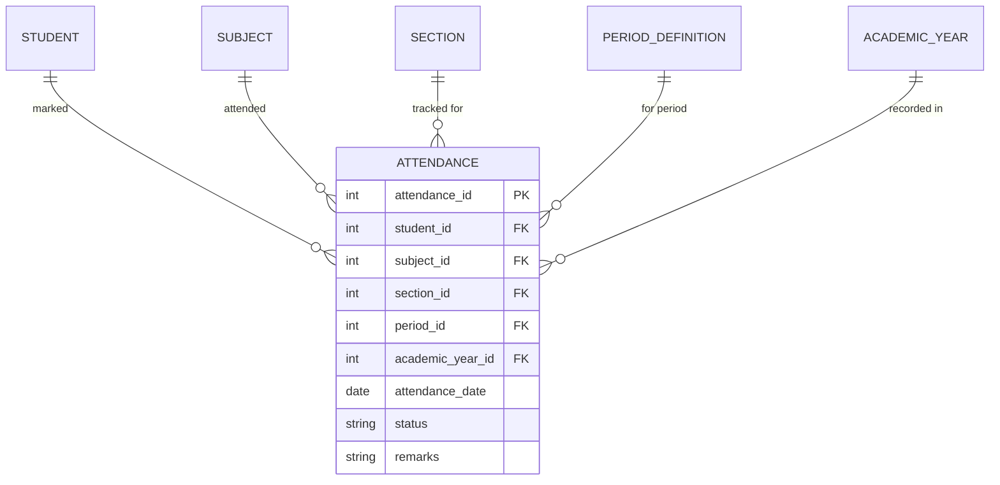
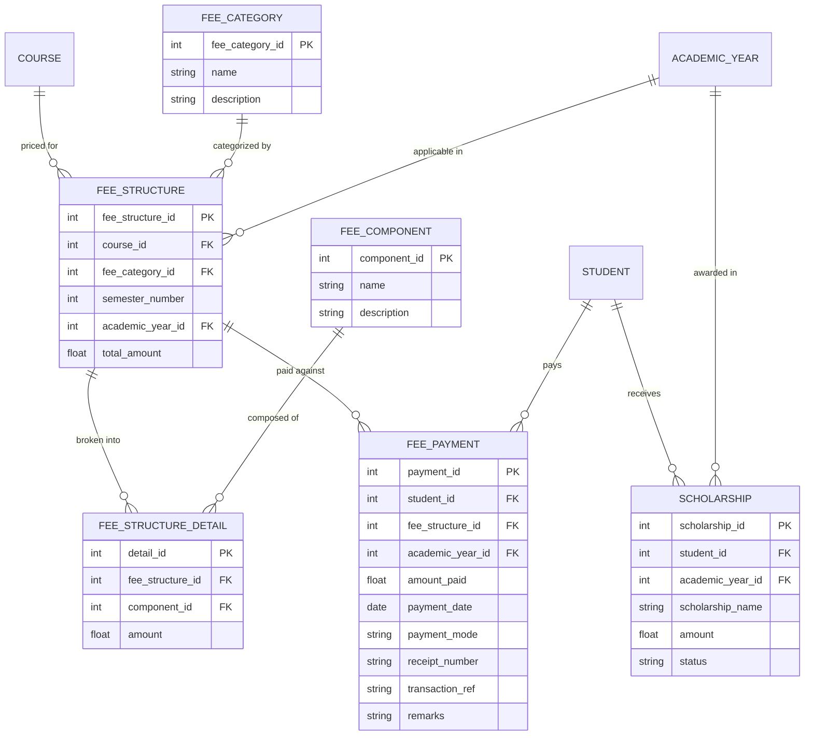
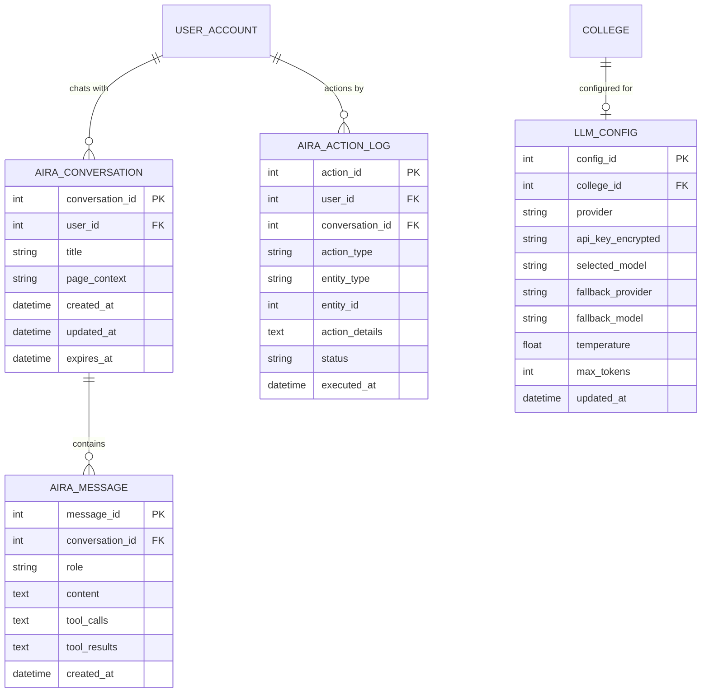
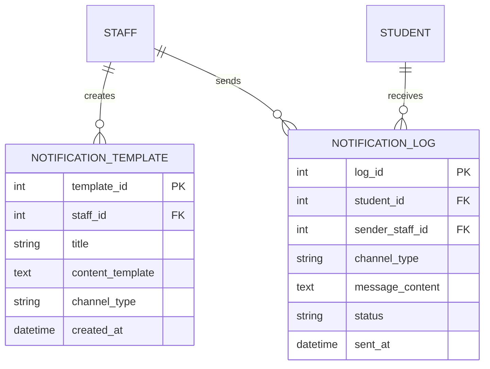

# 🎓 College Management System — Refined Requirements & ER Diagram

## 📋 Requirements Summary

| # | Requirement | Decision |
|---|-------------|----------|
| 1 | College type | Engineering / Technical |
| 2 | Academic system | Credit-based semester (with CGPA) |
| 3 | Student portal | No (admin & staff only) |
| 4 | Parent access | Maybe later |
| 5 | Fee structure | Varies by course AND category |
| 6 | Fee payment tracking | Full tracking (date, amount, mode, receipt, balance) |
| 7 | Exam types | Internal + External + Assignments + Lab practicals |
| 8 | Departments | Yes, with HODs |
| 9 | HOD access | Separate role — department-wide visibility |
| 10 | Timetable | Full scheduling (periods, rooms, staff) |
| 11 | Additional modules | Report generation + AIRA AI Assistant |
| 12 | Multi-campus | Single now, extensible later |
| 13 | Attendance | Both day-wise + period-wise |
| 14 | GPA/CGPA | Auto-calculate with manual override |
| 15 | Grading | Percentage internally + letter grades for university |
| 16 | Electives | No — all subjects fixed per semester |
| 17 | Sections | Varies by department (dynamic) |
| 18 | Academic year | Yes — everything tied to academic year |

---

## 🛠️ Technology Stack

| Component | Technology | Description |
|-----------|------------|-------------|
| **Frontend** | HTML, CSS, JavaScript | Vanilla implementation for maximum control and speed. |
| **Backend** | Python (FastAPI/Flask) | Lightweight and efficient backend. FastAPI recommended for async support. |
| **Database** | MySQL (XAMPP) | Relational database for structured data. |
| **AI Integration** | Ollama (Llama 3.2) | Local LLM for privacy and cost-efficiency. |
| **Orchestration** | Python Scripts | Custom scripts for database management and AI interaction. |

---

## 👥 User Roles & Access Levels

| Role | Access Scope |
|------|-------------|
| **Super Admin** | Full system access — manage college, departments, users, all data |
| **Admin** | Add students, staff, batches, courses, subjects, fees, generate reports |
| **HOD** | Department-wide: view all staff, students, marks, attendance for their dept |
| **Staff** | Own classes only: add/view marks, attendance for assigned subjects |

---

## 🧩 Module Breakdown

### Module 1: User & Authentication Management
- User login with role-based access (Super Admin, Admin, HOD, Staff)
- Password management, session handling
- Activity logs (who did what, when)

### Module 2: College & Department Management
- College info (name, address, logo — for multi-campus readiness)
- Departments (name, code, HOD assignment)

### Module 3: Course & Curriculum Management
- Courses (B.Tech CSE, B.Tech ECE, etc.)
- Semesters (1–8, tied to academic year)
- Subjects (name, code, credits, type: theory/lab, department, semester)
- Curriculum mapping (which subjects in which semester for which course)

### Module 4: Batch, Section & Student Management
- Batches (admission year — e.g., 2023, 2024)
- Sections (A, B, C — dynamic per batch per course)
- Students (personal info, admission details, batch, section, course)

### Module 5: Staff Management
- Staff (personal info, designation, department, joining date)
- Subject allocation (which staff teaches which subject to which section)

### Module 6: Timetable & Scheduling
- Academic year management (start/end dates, current semester)
- Period definitions (period number, start time, end time)
- Rooms / Labs (name, capacity, type)
- Timetable entries (day + period + section → subject + staff + room)

### Module 7: Assessment & Marks Management
- Exam types (Internal, External, Assignment, Lab Practical)
- Exam instances (specific exam for a subject + semester + academic year)
- Marks entry (by student, by subject, by class/section)
- Max marks, passing marks per exam
- Grade mapping table (percentage range → grade → grade point)
- Semester results (GPA per semester, CGPA cumulative)
- Auto-calculate with manual override

### Module 8: Attendance Management
- Period-wise attendance (student + date + period + subject → P/A/OD)
- Day-wise attendance summary (auto-derived from period data)
- Subject-wise attendance percentage
- Attendance entry by class (bulk entry for a section)
- Attendance entry by student (individual view)

### Module 9: Fee Management
- Fee categories (management quota, govt quota, SC/ST, scholarship, etc.)
- Fee structure (course + category + semester → amount breakdown)
- Fee components (tuition, lab, library, exam, hostel, transport, etc.)
- Fee payment transactions (date, amount, mode, receipt no., remarks)
- Pending balance calculation
- Scholarship / concession tracking

### Module 10: Report Generation
- Student mark sheets (semester-wise, with GPA/CGPA)
- Attendance reports (student-wise, subject-wise, section-wise)
- Fee collection reports (paid, pending, defaulters list)
- Department-wise summary reports
- Export options (PDF, Excel)

### Module 11: AIRA — AI Assistant

> [!IMPORTANT]
> AIRA is an AI-powered assistant that overlays on all screens as a floating chat bubble (bottom-right). It helps staff and admins manipulate data, generate reports, and perform actions through natural language.

#### AIRA Requirements Summary

| # | Feature | Decision |
|---|---------|----------|
| 1 | UI Style | Floating chat bubble (bottom-right), expands on click |
| 2 | Access Control | Mirrors logged-in user's role permissions exactly |
| 3 | Chat History | 30-day rolling history, auto-delete after |
| 4 | Action Confirmation | Smart — reads instant, writes/updates/deletes need confirmation |
| 5 | Report Generation | Full — generate & export PDF/Excel directly from chat |
| 6 | Screen Awareness | Context-aware + asks clarification if ambiguous |
| 7 | Voice Input | Maybe later (architecture ready) |
| 8 | Language | English by default, understands other languages |

#### LLM Backend
- **Primary (Cloud):** Google Gemini API — user enters API key in settings
- **Fallback (Local):** Ollama with Llama 3.2 — used when no API key provided
- **Model Selection:** If API key is provided, fetch available models from the API and let user select their preferred model
- **MCP Integration:** Uses Model Context Protocol to interact with app data.
- **MCP Communication Flow:**
  1.  **User Request**: User sends a prompt to AIRA (e.g., "Update attendance for Student X").
  2.  **AIRA Processing**: AIRA analyzes the intent and identifies the required tool (e.g., `update_attendance`).
  3.  **Tool Call**: AIRA constructs a JSON-RPC request for the tool.
  4.  **MCP Client (App)**: The frontend app acts as the MCP Client, receiving the tool call.
  5.  **MCP Server (Backend)**: The request is forwarded to the backend MCP Server.
  6.  **DB Interaction**: The MCP Server executes the database query.
  7.  **Response**: The result is sent back up the chain (DB -> Server -> Client -> AIRA).
  8.  **Final Answer**: AIRA formulates a natural language response for the user.
- **MCP Tool Schema Examples:**
  ```json
  // get_student_info
  {
    "name": "get_student_info",
    "description": "Retrieve student details by ID or Name",
    "inputSchema": {
      "type": "object",
      "properties": {
        "student_identifier": {"type": "string", "description": "Student ID or Name"}
      },
      "required": ["student_identifier"]
    }
  }

  // update_attendance
  {
    "name": "update_attendance",
    "description": "Update attendance status for a student",
    "inputSchema": {
      "type": "object",
      "properties": {
        "student_id": {"type": "integer"},
        "date": {"type": "string", "format": "date"},
        "status": {"type": "string", "enum": ["Present", "Absent", "Late"]}
      },
      "required": ["student_id", "date", "status"]
    }
  }
  ```
- **Additional MCP Integrations:**
  - **File System MCP**: Allow AIRA to directly interact with the server's file system to:
    -   Organize generated reports into specific folders (e.g., `/reports/semester_1/`).
    -   List available report files for download.
    -   Read log files for system debugging (Admin only).

#### AIRA Capabilities
- **Data Queries:** "Show me CSE 3rd sem attendance below 75%"
- **Data Manipulation:** "Mark all CSE-A students present for today's DBMS class" (with confirmation)
- **Report Generation:** "Generate fee defaulters list for ECE department as PDF"
- **Navigation Help:** "Take me to the marks entry page for CSE-B"
- **Analytics:** "What's the average GPA for Mechanical 2023 batch?"
- **Bulk Operations:** "Update all internal marks for CS301 from this CSV" (with confirmation)

#### AIRA Architecture
- Overlay component rendered on every page (globally injected)
- Passes current page context (route, selected filters, active section) to LLM
- Action execution pipeline: User prompt → LLM plans action → Preview shown → User confirms → Execute via API → Show result
- All AIRA actions logged for audit trail

### Module 12: Parent Notification & Communication

> [!NOTE]
> This module is designed for staff to send customized academic updates to parents. It is distinct from the general notice board.

- **Communication Channels:**
  - **SMS / WhatsApp:** For instant alerts (attendance shortage, unexpected absence).
  - **Email:** For detailed reports (weekly performance, exam results).
- **Customizable Templates:**
  - Staff can create and save message templates.
  - Supports dynamic placeholders: `{StudentName}`, `{RollNumber}`, `{AttendancePercentage}`, `{ExamName}`, `{MarksObtained}`, `{SubjectName}`.
  - *Example:* "Dear Parent, {StudentName} has secured {MarksObtained} in {SubjectName} internal exam."
- **Staff Control:**
  - **Manual Trigger:** Staff selects a student (or filter a group), chooses a template, previews the message, edits if needed, and sends one-by-one or in bulk.
  - **History & Logs:** specific "Sent Items" log for each staff member to track what was sent to whom.
- **Access Control:**
  - **Staff:** Can send notifications only to students in their assigned sections/classes.
  - **HOD:** Can send to any student in the department.
  - **Admin:** Can broadcast to the entire college.


---

## 📊 Entity-Relationship Diagrams

> Broken into module-wise diagrams for readability.

### ER 1: Core — College, Department, Course, Batch, Section



---

### ER 2: Users & Authentication



---

### ER 3: Student & Staff



---

### ER 4: Subjects, Allocation & Timetable



---

### ER 5: Exams, Marks & Results



---

### ER 6: Attendance



---

### ER 7: Fees & Scholarships



---

### ER 8: AIRA — AI Assistant



---

### ER 9: Parent Notification



---

---

## 🗂️ Entity Details

### All Entities (35 total)

| # | Entity | Purpose | Key Attributes |
|---|--------|---------|----------------|
| 1 | **College** | Multi-campus ready | name, code, address |
| 2 | **Academic Year** | Groups everything by year | year_label, start/end dates, is_current |
| 3 | **Department** | CSE, ECE, Mech, etc. | name, code, HOD reference |
| 4 | **Course** | B.Tech CSE, B.Tech ECE | name, code, total_semesters, degree_type |
| 5 | **Semester** | Semester 1–8 per academic year | semester_number, start/end dates |
| 6 | **Subject** | Individual subjects with credits | name, code, credits, type (theory/lab) |
| 7 | **Batch** | Admission year grouping | admission_year, label |
| 8 | **Section** | A, B, C divisions within batch+course | name, current_semester |
| 9 | **Student** | Student master data | reg_no, name, contact, admission_type, status |
| 10 | **Staff** | Faculty/staff master data | employee_id, name, designation, department |
| 11 | **User Account** | Login credentials | username, password_hash, role, linked entity |
| 12 | **Role** | Access control | super_admin, admin, hod, staff |
| 13 | **Activity Log** | Audit trail | user, action, entity, timestamp |
| 14 | **Subject Allocation** | Staff ↔ Subject ↔ Section mapping | staff, subject, section, academic_year |
| 15 | **Room** | Classrooms & labs | name, type, capacity, building |
| 16 | **Period Definition** | Time slots | period_number, start/end times |
| 17 | **Timetable** | Schedule entries | day, period, section, subject, staff, room |
| 18 | **Exam Type** | Internal/External/Assignment/Lab | name, description |
| 19 | **Exam** | Specific exam instance | exam_name, date, max_marks, weightage |
| 20 | **Mark** | Student scores | marks_obtained, is_absent, remarks |
| 21 | **Grade Mapping** | % → Grade → Grade Point | ranges, grade_letter, grade_point |
| 22 | **Semester Result** | GPA/CGPA per student | gpa, cgpa, is_manual_override |
| 23 | **Attendance** | Period-wise records | date, period, status (P/A/OD) |
| 24 | **Fee Category** | Mgmt quota, govt, SC/ST, etc. | name |
| 25 | **Fee Component** | Tuition, lab, library, etc. | name |
| 26 | **Fee Structure** | Course + Category → Total | semester, total_amount |
| 27 | **Fee Structure Detail** | Breakdown by component | component, amount |
| 28 | **Fee Payment** | Transaction records | amount, date, mode, receipt_no |
| 29 | **Scholarship** | Concession tracking | name, amount, status |
| 30 | **AIRA Conversation** | Chat sessions per user | title, page_context, expires_at |
| 31 | **AIRA Message** | Individual chat messages | role, content, tool_calls, tool_results |
| 32 | **AIRA Action Log** | Actions taken by AIRA | action_type, entity, status |
| 33 | **LLM Config** | AI model configuration | provider, api_key, model, fallback |
| 34 | **Notification Template** | Saved message formats | content_template, channel_type |
| 35 | **Notification Log** | History of sent messages | student, sender, content, status |

---

## 🔄 Key Relationships Summary

- **College** → has many **Departments**, **Batches**, **Rooms**, **Period Definitions**, **Grade Mappings**
- **Department** → has one **HOD** (Staff), offers many **Courses**, employs many **Staff**
- **Course** → has many **Subjects** (per semester), many **Sections**
- **Batch + Course** → has many **Sections** (A, B, C)
- **Section** → has many **Students**, **Timetable entries**, **Exams**, **Attendance records**
- **Staff** → allocated to **Subjects** per **Section** per **Academic Year**
- **Exam** → belongs to an **Exam Type**, records many **Marks**
- **Student** → has **Marks**, **Attendance**, **Fee Payments**, **Semester Results**, **Scholarships**
- **Fee Structure** → defined per **Course + Category + Semester**, broken into **Components**
- **User Account** → has **AIRA Conversations**, **AIRA Action Logs**, **Activity Logs**
- **Staff** → creates **Notification Templates**, sends **Notification Logs** to **Student**
- **College** → has one **LLM Config** (cloud API key + fallback local model)

---

## ⚡ Important Design Decisions

1. **Section is the core grouping unit** — marks, attendance, timetable, exams all revolve around sections
2. **Subject Allocation** decouples staff-subject mapping from timetable — allows one staff to teach same subject to multiple sections
3. **Exam has weightage_percent** — allows configuring how much each exam type contributes to final grade (e.g., Internal 40% + External 60%)
4. **Attendance uses Period Definition** — enables both period-wise detail and day-wise summary aggregation
5. **Fee Structure is 3-level** — Structure → Details → Payments, supporting flexible fee breakdowns
6. **Grade Mapping is college-level** — can be updated centrally when university changes grading scheme
7. **Semester Result has manual override flag** — supports auto-calc GPA but allows staff to correct it
8. **College entity exists** — ready for multi-campus expansion without schema changes
9. **AIRA uses MCP protocol** — same tool-calling interface for both Ollama (local) and Gemini (cloud) models
10. **LLM Config is college-level** — one config per college, with encrypted API key storage
11. **AIRA conversations auto-expire after 30 days** — keeps database clean
12. **AIRA Action Log is separate from Activity Log** — dedicated audit trail for AI-initiated actions with confirmation status
13. **Smart confirmation pipeline** — read operations execute instantly, write/update/delete operations show preview and require explicit user confirmation
